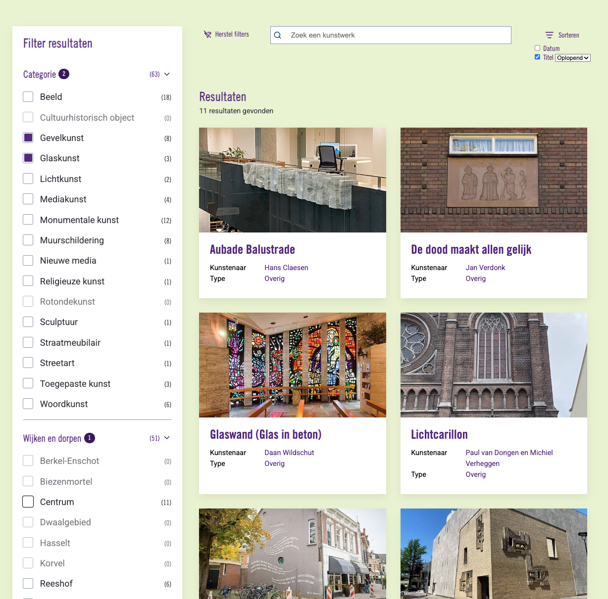
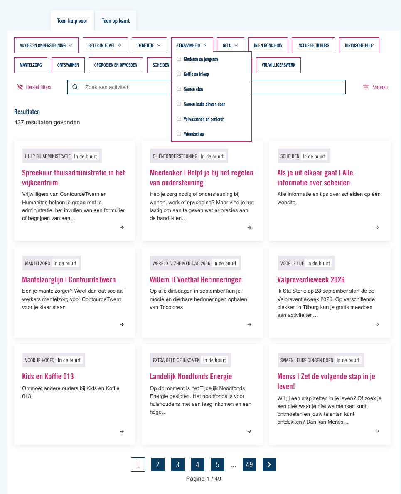

..  _examples:

=======================
Implementation examples
=======================

Two live implementations on the websites of Gemeente Tilburg, one per display
mode.

..  important::
    **Style not included.** The extension ships semantic markup with BEM class
    names, not a finished design. Colours, typography, spacing, cards and
    buttons in the screenshots below all come from the sitepackage of the site
    in question. Out of the box you get the same structure and behaviour, but
    unstyled.

Vertical display mode
=====================

    An art collection filter in :ref:`vertical mode <confval-flexform-displaymode>`.

What is visible here:

-   The filter menu as a **sidebar** with checkboxes, grouped per parent
    category (*Categorie*, *Wijken en dorpen*).
-   :ref:`Result count badges <result-count>` behind every option. Options with
    `(0)` — *Cultuurhistorisch object*, *Rotondekunst*, *Berkel-Enschot* — are
    dimmed and disabled.
-   The active-sub-filter badge on the parent categories: **2** selected under
    *Categorie*, **1** under *Wijken en dorpen*.
-   The parent's own badge shows the rolled-up total, deduplicated: `(63)`.
-   A search field, a *Reset filters* button and the frontend sorting controls
    (*Datum* / *Titel* with an ascending-descending select).

Horizontal display mode
=======================

    An activities listing in :ref:`horizontal mode <confval-flexform-displaymode>`.

What is visible here:

-   The same filter menu rendered as a row of **dropdown facets**, one button
    per parent category, with the checkboxes of its children in the open
    dropdown.
-   Result count badges switched off — `showResultCount` is optional and off by
    default.
-   The search field, reset button and sorting controls in one bar above the
    results.
-   Pagination across 49 pages of 437 results.
